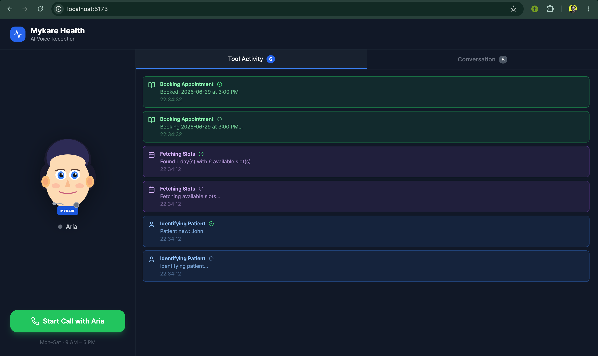

# Mykare Voice AI — Healthcare Front-Desk Agent

A production-ready AI voice agent for healthcare appointment management. Patients call in, talk to **Aria** (the AI receptionist), and can book, view, cancel, or reschedule appointments — all by voice, in real time.

## Screenshots

| Tool Activity — live tool calls during a booking | Conversation — full live transcript |
|---|---|
|  |  |

---

## Table of Contents

1. [What It Does](#what-it-does)
2. [Tech Stack](#tech-stack)
3. [Architecture Overview](#architecture-overview)
4. [Detailed Component Breakdown](#detailed-component-breakdown)
5. [Call Lifecycle — Step by Step](#call-lifecycle--step-by-step)
6. [Real-Time Data Flow](#real-time-data-flow)
7. [Tool System](#tool-system)
8. [Database Schema](#database-schema)
9. [API Reference](#api-reference)
10. [Project Structure](#project-structure)
11. [Prerequisites](#prerequisites)
12. [Setup & Running](#setup--running)
13. [Environment Variables](#environment-variables)
14. [Cost per Call](#cost-per-call)

---

## What It Does

| Capability | Detail |
|---|---|
| Voice conversation | Full-duplex, sub-5s latency, handles 5+ back-and-forth turns |
| Animated avatar | SVG face with lip-sync driven by real-time audio volume |
| Intelligent tool use | 8 tools called automatically based on patient intent |
| Appointment management | Book, view, cancel, reschedule — with double-booking prevention |
| Live transcript | Every conversation turn streamed to the UI in real time |
| Call summary | Auto-generated at call end and persisted to the database |

---

## Tech Stack

| Layer | Technology |
|---|---|
| **Frontend** | React 18, TypeScript, Vite, Tailwind CSS, Zustand |
| **Voice transport** | LiveKit WebRTC (cloud-hosted rooms) |
| **Speech-to-text** | Deepgram Nova-2 (streaming, en-US) |
| **LLM** | Groq — `llama-3.3-70b-versatile` (OpenAI-compatible API) |
| **Text-to-speech** | Cartesia Sonic-3.5 |
| **Agent framework** | LiveKit Agents v1.6.4 (`AgentSession`) |
| **Backend API** | FastAPI + Uvicorn |
| **Database** | SQLite (WAL mode) |
| **Logging** | Python `logging` — rotating file + colored console |

---

## Architecture Overview

```
┌─────────────────────────────────────────────────────────────────────────┐
│                          PATIENT'S BROWSER                               │
│                                                                          │
│  ┌──────────────────────────────────────────────────────────────────┐   │
│  │  React Frontend  (:5173)                                          │   │
│  │                                                                   │   │
│  │  ┌─────────────┐  ┌──────────────┐  ┌────────────────────────┐  │   │
│  │  │ Animated    │  │ Tool Activity│  │ Conversation           │  │   │
│  │  │ Avatar      │  │ Tab          │  │ Transcript Tab         │  │   │
│  │  │ (lip-sync)  │  │ (live)       │  │ (live)                │  │   │
│  │  └─────────────┘  └──────────────┘  └────────────────────────┘  │   │
│  │                                                                   │   │
│  │  useLiveKitRoom.ts ──► livekit-client ──► WebRTC audio/data     │   │
│  │  useAppStore.ts   (Zustand — persists transcript, tools, summary)│   │
│  └──────────────────────────────────────────────────────────────────┘   │
└───────────────┬──────────────────────────────┬──────────────────────────┘
                │  HTTP (REST)                  │  WebRTC + WebSocket
                │  POST /api/start-call         │  (LiveKit room)
                ▼                               ▼
┌───────────────────────────┐    ┌──────────────────────────────────────┐
│  FastAPI  (:8000)         │    │  LiveKit Cloud                        │
│                           │    │                                        │
│  • Create room            │    │  • Room: mykare-{uuid}                 │
│  • Generate JWT token     │◄──►│  • WebRTC media relay                  │
│  • Dispatch agent job     │    │  • Data message relay                  │
│  • REST CRUD endpoints    │    │  • Signal server (wss://)              │
│  • SQLite read/write      │    └──────────────┬───────────────────────┘
│                           │                   │  WebRTC
└───────────────────────────┘                   ▼
         │  SQLite                ┌──────────────────────────────────────┐
         │                        │  LiveKit Agent Worker (subprocess)    │
         ▼                        │                                        │
┌─────────────┐                  │  ┌──────────┐  ┌──────────────────┐  │
│  mykare.db  │                  │  │ Deepgram │  │ Groq             │  │
│             │                  │  │ STT      │  │ llama-3.3-70b    │  │
│  users      │◄─────────────────│  │ Nova-2   │  │ (function calls) │  │
│  appts      │                  │  └──────────┘  └──────────────────┘  │
│  summaries  │                  │                                        │
└─────────────┘                  │  ┌──────────┐  ┌──────────────────┐  │
                                  │  │ Cartesia │  │ 8 Tool Functions │  │
                                  │  │ TTS      │  │ (Python)         │  │
                                  │  │ Sonic-3.5│  └──────────────────┘  │
                                  │  └──────────┘                         │
                                  └──────────────────────────────────────┘
```

---

## Detailed Component Breakdown

### 1. Frontend (`frontend/`)

**Entry point:** `src/main.tsx` → `App.tsx` → `CallInterface.tsx`

| File | Purpose |
|---|---|
| `components/CallInterface.tsx` | Main UI shell — avatar, controls (start/mute/end), tab switcher, call timer |
| `components/Avatar.tsx` | SVG face with real-time lip-sync via `requestAnimationFrame` + volume data; blink animation on 3.5s interval |
| `components/Transcript.tsx` | Scrolling conversation log (user = right, agent = left bubble) |
| `components/ToolCallDisplay.tsx` | Real-time tool call cards with in-progress / completed states |
| `components/CallSummary.tsx` | Post-call summary overlay with patient details and booked appointments |
| `hooks/useLiveKitRoom.ts` | All LiveKit logic — room connection, audio track management, data message parsing, volume analysis |
| `store/useAppStore.ts` | Zustand store — call status, transcript, tool calls, summary; transcript/tools/summary persisted to localStorage |
| `types.ts` | TypeScript interfaces for all domain objects |

**State machine (`CallStatus`):**
```
idle ──► connecting ──► connected ──► ended
                                       │
                                       └──► (reset) ──► idle
```

**Avatar lip-sync mechanism:**
- Agent audio track connected to Web Audio API `AnalyserNode`
- RMS amplitude computed every animation frame
- Mouth SVG path `d` attribute updated proportionally to amplitude
- Outer glow rings scale with volume (0.08–0.12× multiplier)

---

### 2. Backend API (`backend/api.py`)

A FastAPI application served by Uvicorn. Handles:
- Room creation and agent dispatch via `livekit-api`
- All appointment CRUD operations
- Call summary persistence and retrieval

**CORS:** configured to allow the frontend origin (`FRONTEND_URL`).

**Key endpoint — `POST /api/start-call`:**
1. Creates a LiveKit room (`mykare-{uuid}`)
2. Mints a JWT participant token (grants: publish audio, subscribe, publish data)
3. Dispatches the agent worker to that room via `CreateAgentDispatchRequest`
4. Returns `{ token, room_name, ws_url }` to the frontend

---

### 3. Agent Worker (`backend/agent.py`)

A `livekit-agents` v1.6.4 worker process. Each inbound job spawns a `HealthcareAgent` instance inside an `AgentSession`.

**Pipeline:**
```
Mic audio (WebRTC)
      │
      ▼
Deepgram STT (streaming) ──► text transcript
      │
      ▼
Groq LLM (llama-3.3-70b-versatile)
  ├── text response ──► Cartesia TTS ──► audio (WebRTC) ──► patient's speakers
  └── tool call ──► Python function ──► result back to LLM
      │
      ▼
  Tool result emitted via LiveKit data channel ──► frontend UI
```

**Session events monitored:**
| Event | Handler action |
|---|---|
| `conversation_item_added` | Appends to `_transcript`, logs `CONVO [USER/AGENT]`, emits `transcript` data message |
| `close` | Logs session end, sets `shutdown_event` so entrypoint exits cleanly |
| `error` | Logs `SESSION_ERROR` |

**Endpointing:** `min_endpointing_delay=0.8s` — waits 800ms of silence before treating a patient's turn as complete (avoids premature cut-off).

---

### 4. Database (`backend/database.py`)

SQLite in WAL mode for concurrent reads during API requests.

Three tables: `users`, `appointments`, `call_summaries`.

**Double-booking guard:** `create_appointment` checks for an existing `status='booked'` row at the same date+time before inserting.

**Available time slots (hardcoded):** `9:00 AM`, `10:00 AM`, `11:00 AM`, `2:00 PM`, `3:00 PM`, `4:00 PM` — Mon–Sat.

---

### 5. Process Manager (`backend/main.py`)

`asyncio.gather()` runs two coroutines concurrently:
- **`run_api()`** — starts Uvicorn in-process
- **`run_agent()`** — spawns `python agent.py start` as a subprocess

A single `python main.py` starts the entire backend.

---

### 6. Logging (`backend/logging_config.py`)

| Output | Format | Rotation |
|---|---|---|
| Console | Colored by level | — |
| `logs/mykare.log` | Plain text | 10 MB × 5 backups |

All modules call `get_logger(__name__)`. Third-party loggers (httpx, websockets, asyncio) suppressed to WARNING.

---

## Call Lifecycle — Step by Step

```
 Patient                Frontend               FastAPI              LiveKit Cloud          Agent Worker
    │                      │                      │                      │                      │
    │  Click "Start Call"  │                      │                      │                      │
    │─────────────────────►│                      │                      │                      │
    │                      │  POST /api/start-call│                      │                      │
    │                      │─────────────────────►│                      │                      │
    │                      │                      │  Create room         │                      │
    │                      │                      │─────────────────────►│                      │
    │                      │                      │  Dispatch agent job  │                      │
    │                      │                      │─────────────────────►│                      │
    │                      │                      │  ◄─ token + ws_url ──│                      │
    │                      │◄── token + ws_url ───│                      │  ◄── job assigned ───│
    │                      │                      │                      │                      │
    │                      │  WebSocket connect   │                      │  Connect to room     │
    │                      │─────────────────────────────────────────────────────────────────►│
    │                      │◄── Room.Connected ───│                      │                      │
    │                      │                      │                      │  session.start()     │
    │                      │                      │                      │  generate_reply()    │
    │                      │                      │                      │  ◄── Aria greeting ──│
    │                      │◄── audio stream ─────│──────────────────────│◄─────────────────────│
    │◄── hears Aria ───────│                      │                      │                      │
    │                      │                      │                      │                      │
    │  speaks (e.g. "I want│to book an appt")     │                      │                      │
    │─────────────────────►│  mic audio (WebRTC)  │                      │─────────────────────►│
    │                      │                      │                      │  Deepgram STT        │
    │                      │                      │                      │  ◄── text transcript  │
    │                      │                      │                      │  Groq LLM            │
    │                      │                      │                      │  ◄── tool call        │
    │                      │                      │                      │  fetch_slots()        │
    │                      │◄── tool_start event ─│──────────────────────│◄─────────────────────│
    │                      │  (Tool Activity tab) │                      │  DB query            │
    │                      │                      │  ◄── SQLite ─────────│◄─────────────────────│
    │                      │◄── tool_result event ─────────────────────────────────────────────│
    │                      │                      │                      │  Groq LLM response   │
    │                      │                      │                      │  Cartesia TTS        │
    │◄── hears slot options│◄── audio stream ─────│──────────────────────│◄─────────────────────│
    │                      │                      │                      │                      │
    │  "Book Tuesday 2pm"  │                      │                      │                      │
    │─────────────────────►│  ...                 │                      │  book_appointment()  │
    │                      │◄── tool events ───────────────────────────────────────────────────│
    │                      │                      │                      │  INSERT appointment  │
    │◄── "Booked! ..."     │◄── audio + transcript│──────────────────────│◄─────────────────────│
    │                      │◄── transcript event ──────────────────────────────────────────────│
    │                      │                      │                      │                      │
    │  "That's all thanks" │                      │                      │                      │
    │─────────────────────►│                      │                      │  end_conversation()  │
    │                      │                      │                      │  save_call_summary() │
    │                      │◄── summary event ─────────────────────────────────────────────────│
    │                      │◄── call_ended event ──────────────────────────────────────────────│
    │                      │  show CallSummary    │                      │                      │
```

---

## Real-Time Data Flow

The agent emits structured JSON messages over the LiveKit data channel (reliable, ordered). The frontend's `handleAgentEvent()` in `useLiveKitRoom.ts` routes them:

```
Agent process                          Frontend (useAppStore)
──────────────────────────────────────────────────────────
{ type: "tool_start", tool, message }  →  addToolCall({ status: "in_progress" })
{ type: "tool_result", tool, message } →  addToolCall({ status: "completed" })
{ type: "transcript", data: {role, text} } →  addTranscript(entry)
{ type: "summary", data: {...} }       →  setSummary(summaryPayload)
{ type: "call_ended" }                 →  setCallStatus("ended")
```

All events include an ISO timestamp. Tool calls are capped at 20 entries in the store (newest first).

---

## Tool System

All tools are Python `async` methods on `HealthcareAgent` decorated with `@function_tool`. The Groq LLM decides which tool to call based on the conversation. Each tool:
1. Logs `TOOL_START` with parameters
2. Emits `tool_start` data message to frontend
3. Executes the DB operation
4. Emits `tool_result` data message
5. Logs `TOOL_END` with elapsed ms and success flag
6. Returns a JSON string to the LLM

| Tool | Trigger | DB operation | Guard |
|---|---|---|---|
| `identify_user(phone, name)` | First thing after getting phone | `INSERT OR UPDATE users` | None — must be called before booking |
| `fetch_slots(date?)` | Patient asks about availability | `SELECT` booked slots, return free ones | — |
| `book_appointment(date, time, notes?)` | Patient confirms a slot | `INSERT appointments` | Blocked if `_user_id` not set; double-booking check |
| `retrieve_appointments()` | Patient asks "what do I have booked?" | `SELECT appointments WHERE user_id=?` | Blocked if `_user_id` not set |
| `cancel_appointment(appointment_id)` | Patient asks to cancel | `UPDATE status='cancelled'` | Checks appointment belongs to this user |
| `modify_appointment(id, new_date, new_time)` | Patient asks to reschedule | `UPDATE date, time_slot` | Conflict check on target slot |
| `summarize_conversation()` | Patient asks "what did we discuss?" or mid-call check | Builds summary from `_transcript` list | — |
| `end_conversation(summary, preferences?, intent?)` | Conversation naturally ends | `INSERT call_summaries`; emits `summary` + `call_ended` | — |

---

## Database Schema

```sql
CREATE TABLE users (
    id           INTEGER PRIMARY KEY AUTOINCREMENT,
    phone_number TEXT UNIQUE NOT NULL,      -- used as patient's unique ID
    name         TEXT DEFAULT '',
    created_at   TEXT DEFAULT (datetime('now'))
);

CREATE TABLE appointments (
    id         INTEGER PRIMARY KEY AUTOINCREMENT,
    user_id    INTEGER NOT NULL REFERENCES users(id),
    date       TEXT NOT NULL,               -- YYYY-MM-DD
    time_slot  TEXT NOT NULL,               -- e.g. "2:00 PM"
    status     TEXT DEFAULT 'booked',       -- 'booked' | 'cancelled'
    notes      TEXT DEFAULT '',
    created_at TEXT DEFAULT (datetime('now'))
);

CREATE TABLE call_summaries (
    id                INTEGER PRIMARY KEY AUTOINCREMENT,
    session_id        TEXT UNIQUE NOT NULL,
    user_id           INTEGER REFERENCES users(id),
    phone_number      TEXT,
    user_name         TEXT,
    summary           TEXT,                 -- LLM-generated free text
    appointments_json TEXT DEFAULT '[]',    -- JSON array of booked appointments
    preferences       TEXT DEFAULT '',
    intent            TEXT DEFAULT '',      -- e.g. "book appointment"
    created_at        TEXT DEFAULT (datetime('now'))
);
```

---

## API Reference

| Method | Path | Body / Params | Returns |
|---|---|---|---|
| `GET` | `/api/health` | — | `{ status, timestamp }` |
| `POST` | `/api/start-call` | `{ user_name?, phone_number? }` | `{ token, room_name, ws_url, user_identity }` |
| `GET` | `/api/slots` | `?date=YYYY-MM-DD` (optional) | `{ slots: [{ date, available_times[] }] }` |
| `GET` | `/api/appointments/{phone}` | — | `{ appointments[], phone }` |
| `POST` | `/api/appointments` | `{ phone_number, date, time_slot, notes? }` | `{ success, appointment_id, date, time }` |
| `PUT` | `/api/appointments/{id}` | `{ phone_number, new_date, new_time }` | `{ success, appointment_id, new_date, new_time }` |
| `DELETE` | `/api/appointments/{id}` | `?phone_number=...` | `{ success, message }` |
| `POST` | `/api/summary` | `SummaryRequest` | `{ success, session_id }` |
| `GET` | `/api/summary/{session_id}` | — | Full summary object |

---

## Project Structure

```
mykare-voice-ai/
├── backend/
│   ├── main.py             # Entry point — starts API + agent worker
│   ├── api.py              # FastAPI routes + request models
│   ├── agent.py            # LiveKit agent — HealthcareAgent + entrypoint
│   ├── database.py         # SQLite helpers (init, CRUD, call summaries)
│   ├── logging_config.py   # Centralized logging (colored console + rotating file)
│   ├── requirements.txt    # Python dependencies
│   ├── .env.example        # Template for required env vars (no real keys)
│   └── logs/
│       └── mykare.log      # Rotating log (10 MB × 5 backups)
│
├── frontend/
│   ├── src/
│   │   ├── App.tsx
│   │   ├── main.tsx
│   │   ├── types.ts                      # Shared TypeScript types
│   │   ├── components/
│   │   │   ├── CallInterface.tsx          # Main UI layout
│   │   │   ├── Avatar.tsx                # Animated SVG face
│   │   │   ├── Transcript.tsx            # Live conversation bubbles
│   │   │   ├── ToolCallDisplay.tsx       # Tool activity feed
│   │   │   └── CallSummary.tsx           # End-of-call summary card
│   │   ├── hooks/
│   │   │   └── useLiveKitRoom.ts         # LiveKit connection + event handling
│   │   └── store/
│   │       └── useAppStore.ts            # Zustand state (persisted to localStorage)
│   ├── package.json
│   └── vite.config.ts                    # Proxy: /api → localhost:8000
│
├── .gitignore
└── README.md
```

---

## Prerequisites

Sign up for these services (all have free tiers):

| Service | URL | Free tier |
|---|---|---|
| LiveKit Cloud | https://cloud.livekit.io | Free — get URL + API key + secret |
| Deepgram | https://deepgram.com | $200 free credit |
| Cartesia | https://cartesia.ai | Free trial |
| Groq | https://console.groq.com | Free tier — 500k tokens/day on `llama-3.1-8b-instant` |

---

## Setup & Running

### Backend

```bash
cd backend

# 1. Create and activate virtualenv
python3 -m venv .venv
source .venv/bin/activate          # Windows: .venv\Scripts\activate

# 2. Install dependencies
pip install -r requirements.txt

# 3. Configure environment
cp .env.example .env
# Edit .env and fill in your real API keys

# 4. Start API + agent worker together
python main.py
```

Backend is ready when you see:
```
Mykare Voice AI Backend
API + Agent Worker starting...
FastAPI starting on http://0.0.0.0:8000
Agent worker started | pid=...
```

### Frontend

```bash
cd frontend
npm install
npm run dev
```

Open **http://localhost:5173**

> Vite proxies `/api` → `http://localhost:8000` — no CORS issues in dev.

### Verify the agent is registered

After starting the backend, check that the agent worker connected to LiveKit:
```
INFO | livekit.agents | worker registered successfully
```
If you see `signal connection timed out`, check your `LIVEKIT_URL` in `.env`.

---

## Environment Variables

```env
# LiveKit (cloud.livekit.io → your project → Settings)
LIVEKIT_URL=wss://your-project.livekit.cloud
LIVEKIT_API_KEY=APIxxxxxxxxxxxxxxxxx
LIVEKIT_API_SECRET=xxxxxxxxxxxxxxxxxxxxxxxxxxxxxxxxxxxxxxxxxxxxxxxx

# Deepgram (console.deepgram.com)
DEEPGRAM_API_KEY=xxxxxxxxxxxxxxxxxxxxxxxxxxxxxxxxxxxxxxxx

# Cartesia (app.cartesia.ai)
CARTESIA_API_KEY=sk_car_xxxxxxxxxxxxxxxxxxxxxxxxxx
CARTESIA_VOICE_ID=a0e99841-438c-4a64-b679-ae501e7d6091  # default Aria voice

# Groq (console.groq.com)
GROQ_API_KEY=gsk_xxxxxxxxxxxxxxxxxxxxxxxxxxxxxxxxxxxxxxxxxx

# Database
DB_PATH=mykare.db

# API server
API_HOST=0.0.0.0
API_PORT=8000

# CORS — must match your frontend URL
FRONTEND_URL=http://localhost:5173
```

---

## Cost per Call

Approximate for a 5-minute call (2 participants).

| Service | Rate | Per 5-min call |
|---|---|---|
| Deepgram Nova-2 | $0.0043 / min | ~$0.022 |
| Cartesia Sonic-3.5 | $0.01 / min | ~$0.05 |
| Groq llama-3.3-70b | ~$0.00059 / 1K tokens | ~$0.01 |
| LiveKit Cloud | $0.006 / min / participant | ~$0.06 |
| **Total** | | **~$0.14 / call** |

On Groq's free tier (`llama-3.1-8b-instant` at 500k tokens/day) and LiveKit's free tier, development and testing costs nothing.
